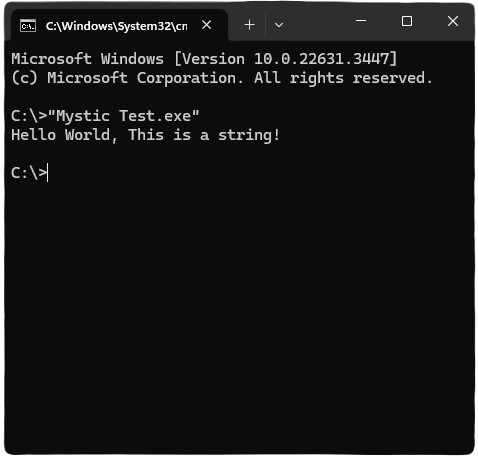
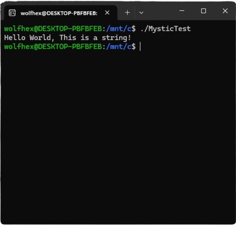

<div align="center">
	
	<h1>Mystic</h1>
	<p>
		<b>A C++17 header-only library that provides compile-time string encryption and decryption using SIMD instructions and code obfuscation.</b>
	</p>
	<p>
	<b>v2 Release!</b>
	</p>
	<br>
</div>

## Features
* **Compile-Time Encryption:** Encrypts strings at compile-time.
* **SIMD Decryption:** Decrypts encrypted strings at runtime using SIMD operations.
* **Vectorized Operations:** Utilizes AVX and SSE instructions to process string data.
* **Random Key Generation:** Generates encryption keys and initialization vectors (IV) using constexpr computations based on a compile-time seed derived from the `__TIME__` macro.
* **Disassembly Bloating:** Add junk code to the executable, slightly impacts performance but makes the disassembly a mess.
## Example

Here is a simple example demonstrating string encryption and decryption using Mystic:

```cpp
#define AVX_AVAILABLE // Tells Mystic that your CPU is compatible with AVX instructions

#include <mystic.hh>
#include <iostream>

int main() {
	// Use MYSTIFY_BLOAT or M_APPLY_STACK_BLOAT to add bloating,
	// DO NOT overuse them!
	std::cout << MYSTIFY("Hello World, This is a string!") << std::endl;

	return 0;
}
```

Tested on Windows using AVX and SSE instructions and Ubuntu using AVX instructions

## Support

Tested on MSVC and GCC but should work correctly on most compilers. To enable AVX support you have to define `AVX_AVAILABLE`. If your CPU doesn't support AVX you can define `SSE_AVAILABLE`.

## Results

Runtime Result:

|  |  |
|:----------------------------------:|:-----------------------------------:|
| Windows Executable (MSVC v143)     | ELF Executable (GCC v11)    |

Part of IDA64 disassembly of `MYSTIFY("Hello World, This is a string!");` using AVX from the ELF executable, WITHOUT bloating.

```asm
endbr64
push    rbp
mov     r10d, 0Fh
mov     rdx, 22CA7CFB7668F832h
vmovq   xmm5, rdx
mov     rbp, rsp
push    r15
push    r14
push    r13
xor     r13d, r13d
push    r12
push    rbx
mov     ebx, 1
and     rsp, 0FFFFFFFFFFFFFFE0h
add     rsp, 0FFFFFFFFFFFFFF80h
mov     rax, fs:28h
mov     [rsp+0B0h+var_38], rax
xor     eax, eax
lea     r14, [rsp+0B0h+var_80]
lea     r12, [rsp+0B0h+var_6F]
mov     rax, 2650EF3C78B6EF2h
vmovq   xmm3, rax
lea     r9, [rsp+0B0h+var_51]
mov     [rsp+0B0h+var_90], r14
mov     rax, 0E3446A6AAC5F1D6Eh
vmovq   xmm4, rax
vpbroadcastq ymm1, xmm3
mov     rax, r14
mov     byte ptr [rsp+0B0h+var_80], 0
vpbroadcastq ymm0, xmm4
vpsllq  ymm2, ymm1, 6
vpsllq  ymm0, ymm0, 3
vpand   ymm0, ymm0, ymm2
vpbroadcastq ymm2, xmm5
vpxor   ymm0, ymm0, cs:ymmword_2020
vpxor   ymm1, ymm1, ymm2
vpxor   ymm0, ymm0, ymm1
vpextrb r15d, xmm0, 0
vmovdqa ymmword ptr [rsp+40h], ymm0
vzeroupper
nop     dword ptr [rax+00h]
```

## Related Projects
Similar libraries i found helpful

* [JustasMasiulis's xorstr](https://github.com/JustasMasiulis/xorstr)
* [qis's xorstr](https://github.com/qis/xorstr)
* [adamyaxley's Obfuscate](https://github.com/adamyaxley/Obfuscate)

### Donating
MetaMask wallet address: `0x1E5a982BD1E54d3CD4EcD7A74642ed808783D506`

<a href='https://ko-fi.com/D1D3NTABI' target='_blank'></a>
Thank you!